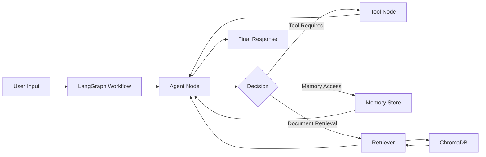
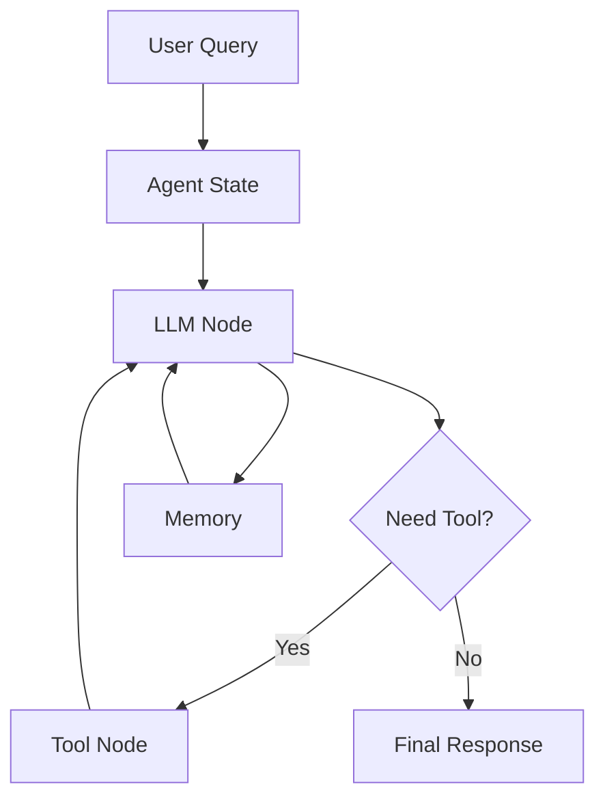
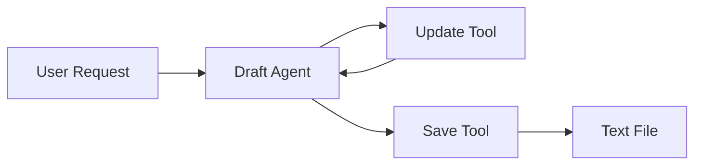
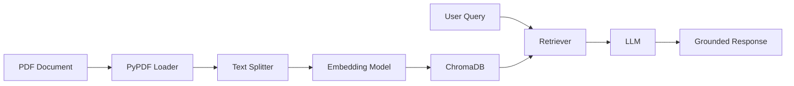

<div align="center">

# AI Agents & RAG Systems with LangGraph

### Building Production-Ready AI Agents, Multi-Agent Workflows, and RAG Systems with LangGraph

[](https://python.org)
[](https://langchain-ai.github.io/langgraph/)
[](https://www.langchain.com/)
[](https://ollama.com/)
[](https://www.trychroma.com/)

**A comprehensive hands-on repository for learning Agent Engineering using LangGraph, LangChain, Ollama, and Retrieval-Augmented Generation (RAG).**

Designed for students, AI engineers, researchers, and developers interested in building stateful AI systems, tool-using agents, multi-agent workflows, and local-first LLM applications.

</div>

---

# Project Highlights

* ✅ Graph-based AI Agent Design with LangGraph
* ✅ Stateful & Stateless Agent Architectures
* ✅ Conversation Memory Management
* ✅ Conditional Workflow Routing
* ✅ ReAct Tool-Calling Agents
* ✅ Multi-Step Reasoning Workflows
* ✅ Multi-Agent Coordination Patterns
* ✅ Document Drafting Agents
* ✅ Retrieval-Augmented Generation (RAG)
* ✅ Local LLM Deployment using Ollama
* ✅ ChromaDB Vector Database Integration
* ✅ End-to-End Production Agent Engineering Concepts

---

# Business Problem

Modern AI applications require significantly more than a single LLM call.

Production systems must handle:

* Stateful interactions
* Memory persistence
* Tool invocation
* Workflow orchestration
* Multi-agent collaboration
* Document retrieval
* Reliable reasoning loops

Traditional prompt chaining quickly becomes difficult to maintain and scale.

This repository demonstrates how to build robust AI systems using graph-based orchestration with LangGraph, enabling modular, scalable, and production-oriented agent workflows.

---

# Objectives

The primary goals of this repository are:

* Understand graph-based AI architectures
* Learn LangGraph workflow design patterns
* Build memory-enabled conversational systems
* Implement ReAct-style tool-using agents
* Create multi-agent pipelines
* Develop Retrieval-Augmented Generation systems
* Run complete AI applications locally using Ollama
* Build reusable foundations for production AI systems

---

# Table of Contents

* [Project Overview](#-project-overview)
* [Technology Stack](#-technology-stack)
* [System Architecture](#-system-architecture)
* [Learning Roadmap](#-learning-roadmap)
* [Agent Implementations](#-agent-implementations)
* [RAG Pipeline](#-retrieval-augmented-generation-rag)
* [Project Structure](#-project-structure)
* [Installation](#-installation-guide)
* [Usage](#-usage)
* [Reproducibility](#-reproducibility)
* [Future Improvements](#-future-improvements)
* [Key Learnings](#-key-learnings)
* [Author](#-author)

---

# Project Overview

This repository provides a structured progression from simple LLM interactions to advanced AI agent systems.

The project introduces increasingly sophisticated concepts through standalone implementations:

| Phase                   | Focus Area                     |
| ----------------------- | ------------------------------ |
| Foundation              | Stateless AI Agents            |
| State Management        | Memory & Persistence           |
| Workflow Design         | Sequential & Conditional Flows |
| Reasoning               | ReAct Agent Patterns           |
| Agent Control           | Looping & Dynamic Execution    |
| Multi-Agent Systems     | Agent Collaboration            |
| Production Applications | Document Drafting              |
| Knowledge-Augmented AI  | Retrieval-Augmented Generation |

---

# Technology Stack

| Category                | Technologies                   |
| ----------------------- | ------------------------------ |
| Programming Language    | Python                         |
| Agent Framework         | LangGraph                      |
| LLM Framework           | LangChain                      |
| LLM Runtime             | Ollama                         |
| Models                  | Llama 3.2, Gemma 2B            |
| Embedding Model         | mxbai-embed-large              |
| Vector Database         | ChromaDB                       |
| Document Processing     | PyPDF                          |
| Text Chunking           | RecursiveCharacterTextSplitter |
| Development Environment | Jupyter Notebook               |
| State Management        | LangGraph StateGraph           |
| Tool Calling            | LangChain Tools                |
| Multi-Agent Workflows   | LangGraph Graph Nodes          |

---

# System Architecture

## End-to-End Workflow



---

# LangGraph Architecture



---

# Learning Roadmap

```text
Phase 0 — Foundations
│
├── bot_agent.py
└── single_input_agent.ipynb

Phase 1 — State Management
│
├── memory_agent.py
├── sequential_agent.ipynb
└── conditional_agent.ipynb

Phase 2 — Tool Use & Reasoning
│
├── react_agent.py
└── looping_agent.ipynb

Phase 3 — Multi-Agent Coordination
│
└── multiple_input_agent.ipynb

Phase 4 — Production Applications
│
├── drafter_agent.py
├── rag_agent.py
└── exercises
```

---

# Agent Implementations

## 1. Basic Chat Agent

### Purpose

Introduces LangGraph fundamentals using a single-node workflow.

### Concepts

* StateGraph
* START & END nodes
* LLM Invocation
* Stateless execution

### Skills Developed

* Graph construction
* Agent lifecycle understanding

---

## 2. Memory Agent

### Purpose

Maintains conversation context across interactions.

### Concepts

* Conversation persistence
* Message history
* Stateful workflows

### Benefits

* Multi-turn conversations
* Context-aware responses

---

## 3. Sequential Agent

### Purpose

Execute tasks in a predefined sequence.

### Concepts

* Linear workflow orchestration
* State transitions

### Use Cases

* Document pipelines
* ETL-style processing

---

## 4. Conditional Agent

### Purpose

Route execution dynamically based on state.

### Concepts

* Conditional edges
* Decision nodes
* Dynamic routing

### Benefits

* Adaptive workflows
* Intelligent branching

---

## 5. ReAct Agent

### Purpose

Combine reasoning with tool usage.

### Features

* Arithmetic tools
* Tool routing
* Iterative reasoning

### Implemented Tools

| Tool     | Function                  |
| -------- | ------------------------- |
| Add      | Arithmetic Addition       |
| Subtract | Arithmetic Subtraction    |
| Multiply | Arithmetic Multiplication |

---

## 6. Looping Agent

### Purpose

Support iterative reasoning loops until completion.

### Concepts

* Repeated execution
* Dynamic stopping conditions
* Agent control flow

---

## 7. Multi-Agent Workflow

### Purpose

Coordinate multiple agents working together.

### Concepts

* Agent specialization
* Shared state
* Task delegation

### Applications

* Research assistants
* Enterprise workflows
* Autonomous task systems

---

## 8. Document Drafter Agent

### Purpose

Create and manage evolving documents through tool-based editing.

### Features

* Content updating
* Draft management
* Document persistence
* File generation

### Workflow



---

# Retrieval-Augmented Generation (RAG)

The repository includes a complete local RAG implementation.

## Workflow



---

## RAG Components

| Component                      | Purpose             |
| ------------------------------ | ------------------- |
| PyPDFLoader                    | PDF Ingestion       |
| RecursiveCharacterTextSplitter | Chunk Creation      |
| Ollama Embeddings              | Vector Embeddings   |
| ChromaDB                       | Vector Storage      |
| Retriever Tool                 | Semantic Search     |
| Llama 3.2                      | Response Generation |

---

## Knowledge Source

The RAG agent demonstrates retrieval from a financial market PDF.

Capabilities include:

* Semantic document search
* Context retrieval
* Grounded question answering
* Hallucination reduction

---

# Project Structure

```text
AI-Agents-and-RAG-Systems-with-LangGraph/
│
├── bot_agent.py
├── memory_agent.py
├── react_agent.py
├── drafter_agent.py
├── rag_agent.py
│
├── single_input_agent.ipynb
├── sequential_agent.ipynb
├── conditional_agent.ipynb
├── looping_agent.ipynb
├── multiple_input_agent.ipynb
│
├── exercise_for_single_input_agent.ipynb
├── exercise_for_sequential_agent.ipynb
├── exercise_for_conditional_agent.ipynb
├── exercise_for_looping_agent.ipynb
├── exercise_for_multiple_input_agent.ipynb
│
├── Stock_Market_Performance_2024.pdf
├── my_document.txt
├── conversation_history.txt
│
├── requirements.txt
└── README.md
```

---

# Installation Guide

## Clone Repository

```bash
git clone https://github.com/Mohit-1307/AI-Agents-and-RAG-Systems-with-LangGraph.git

cd AI-Agents-and-RAG-Systems-with-LangGraph
```

---

## Create Virtual Environment

### Windows

```bash
python -m venv venv

venv\Scripts\activate
```

### Linux/macOS

```bash
python3 -m venv venv

source venv/bin/activate
```

---

## Install Dependencies

```bash
pip install -r requirements.txt
```

---

## Pull Local Models

```bash
ollama pull llama3.2

ollama pull gemma:2b

ollama pull mxbai-embed-large
```

---

## Verify Ollama

```bash
ollama list
```

---

# Usage

## Run Basic Agent

```bash
python bot_agent.py
```

## Run Memory Agent

```bash
python memory_agent.py
```

## Run ReAct Agent

```bash
python react_agent.py
```

## Run Document Drafter

```bash
python drafter_agent.py
```

## Run RAG Agent

```bash
python rag_agent.py
```

## Launch Notebooks

```bash
jupyter notebook
```

---

# Reproducibility

To reproduce all experiments:

### Step 1

Clone the repository.

### Step 2

Install dependencies.

### Step 3

Install Ollama.

### Step 4

Download required models.

### Step 5

Execute notebooks in learning order.

### Step 6

Run Python implementations.

### Step 7

Experiment with custom workflows.

---

# Repository Coverage

| Capability             | Implemented |
| ---------------------- | ----------- |
| LangGraph Fundamentals | ✅           |
| Stateful Agents        | ✅           |
| Conversation Memory    | ✅           |
| Conditional Routing    | ✅           |
| ReAct Agents           | ✅           |
| Tool Calling           | ✅           |
| Multi-Agent Systems    | ✅           |
| Document Agents        | ✅           |
| RAG Pipelines          | ✅           |
| Local LLM Execution    | ✅           |
| ChromaDB Integration   | ✅           |

---

# Challenges Addressed

* Agent state management
* Workflow orchestration
* Dynamic routing
* Tool execution reliability
* Retrieval quality
* Local model deployment
* Memory persistence
* Multi-step reasoning

---

# Future Improvements

## Agent Enhancements

* Human-in-the-loop workflows
* Long-term memory systems
* Agent evaluation framework
* Reflection agents
* Planning agents

## RAG Enhancements

* Hybrid retrieval
* Query rewriting
* Re-ranking
* Multi-document retrieval
* Citation generation

## Production Deployment

* FastAPI integration
* Docker support
* Kubernetes deployment
* LangSmith observability
* CI/CD pipelines

---

# Key Learnings

This repository demonstrates:

* Agent Engineering Fundamentals
* Graph-Based AI System Design
* LangGraph Workflow Patterns
* Memory-Driven Agents
* Tool-Augmented Reasoning
* Multi-Agent Architectures
* Retrieval-Augmented Generation
* Local LLM Operations

---

# Author

**MOHIT SINGH RAJPUT** — AI / ML Engineer

[](https://linkedin.com/in/mohitsingh1307)
[](https://github.com/Mohit-1307)
[](https://www.kaggle.com/mohitsinghrajput1307)
[](https://leetcode.com/u/MOHIT_SINGH_RAJPUT/)
[](mailto:mohitsinghrajput1307@gmail.com)

---

# Acknowledgements

Special thanks to:

* LangGraph Team
* LangChain Team
* Ollama Team
* ChromaDB Team
* Open Source AI Community

for building the tools that make modern agent engineering accessible.

---

<div align="center">

*If this project was useful, a ⭐ on the repository is appreciated.*

</div>